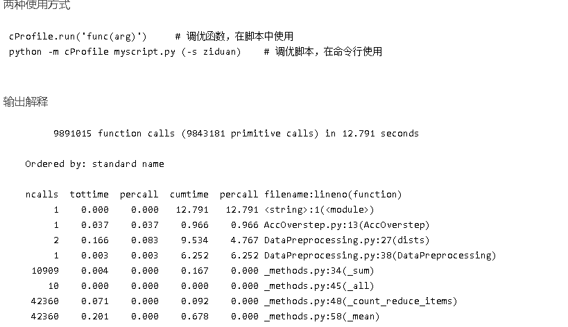

# 用法
写代码经常会听说一些名词，比如 性能分析、代码调优。

cProfile 是 python 代码调优的一种工具，它能够统计在整个代码执行过程中，每个函数调用的次数和消耗的时间。

两种使用方式：

共有 9891015 次函数调用，原始调用为 9843181 次，原始调用代表不包含递归调用。

ncalls 函数的被调用次数 

---------------------------
tottime 函数总计运行时间，**除去函数中调用的函数运行时间** 

percall 函数运行一次的平均时间，等于tottime/ncalls 

---------------------------
cumtime 函数总计运行时间，**含调用的函数运行时间** 

percall 函数运行一次的平均时间，等于cumtime/ncalls 

---------------------------
filename:lineno(function) 函数所在的文件名，函数的行号，函数名

